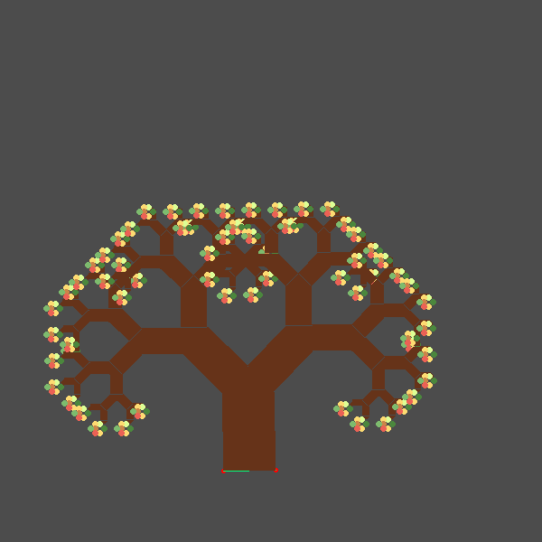
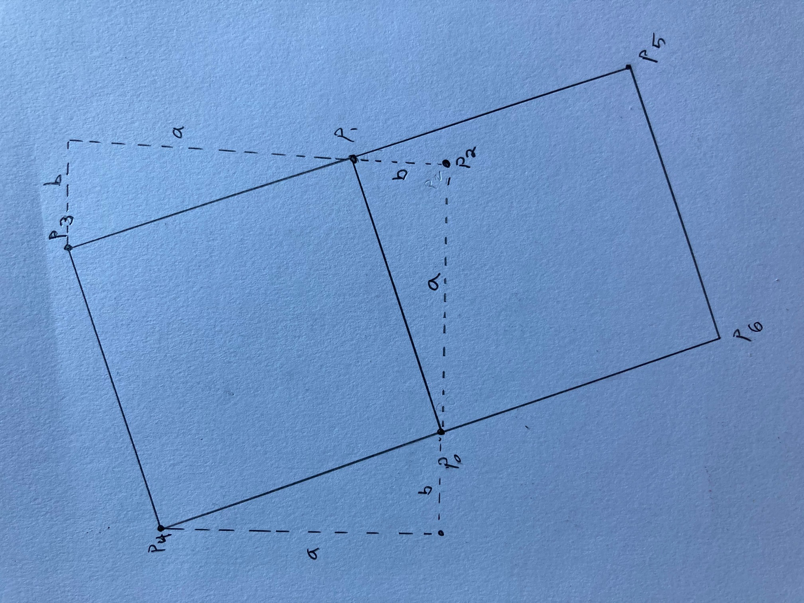
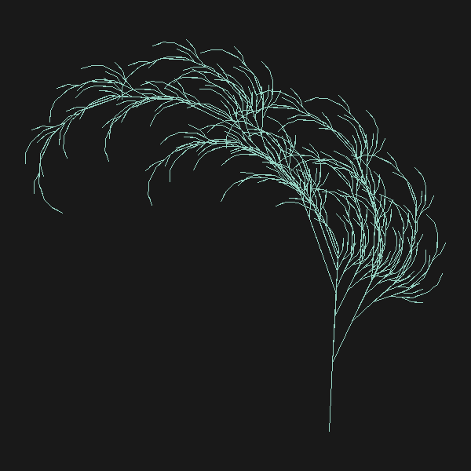
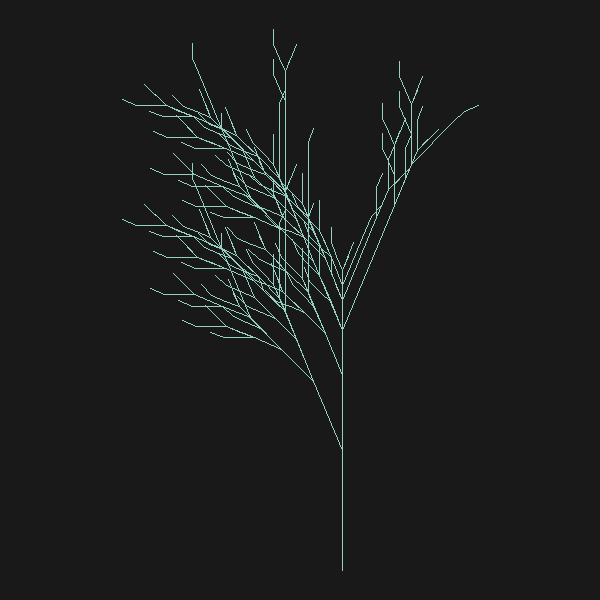
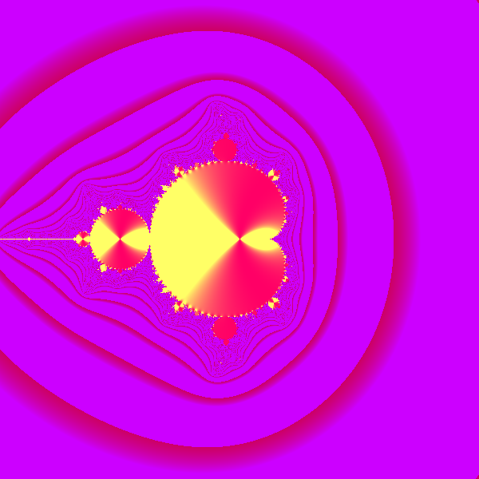
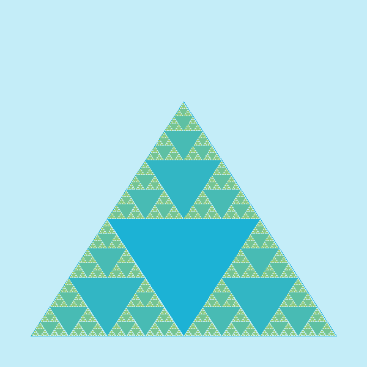
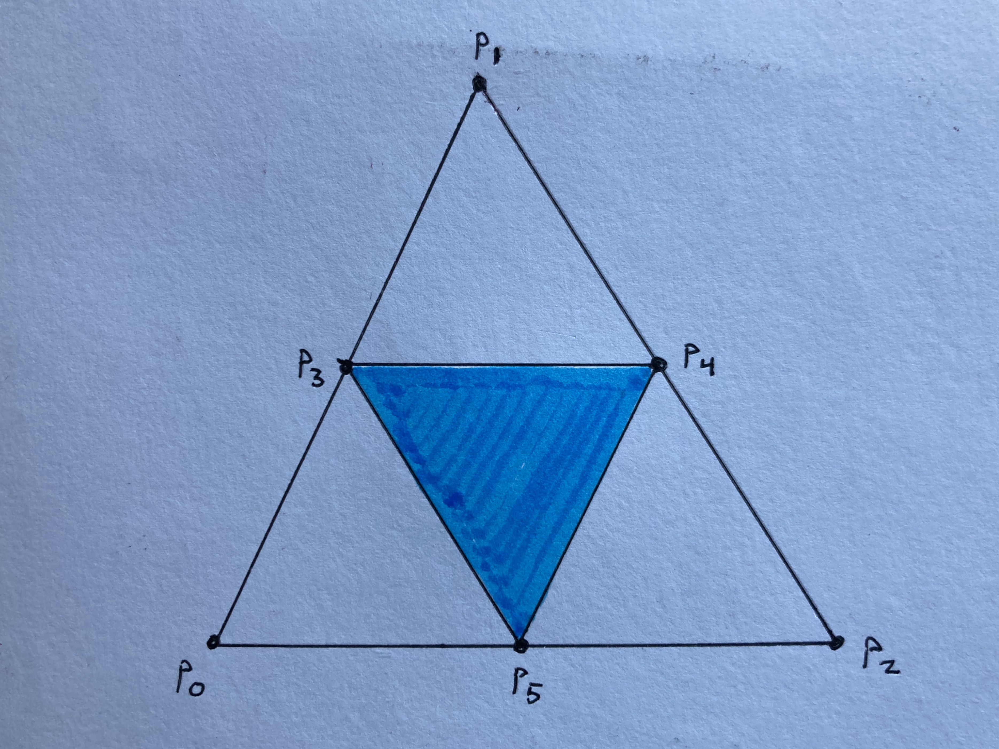

# Final Portfolio Project
**Evan DePosit**  
**CS 410 Exploring Fractals**  

## Compiling

`cc yourProgram.c -lm -lX11`  

## Instalation

To install graphics stuff, `sudo apt-get install`:  
 g++  
 libx11-dev  
 libxext-dev  
 x11-apps  

## Journal Entries

### (1) Iterated Function system: Initials Block Letters


#### Design Paradigm and Mathematical Description

The program starts with a single point where 0≤x≤1 and 0≤y≤1 on a square two dimensional plane that represents the "papa" fractal.  Each "baby" fractal exists within the "papa" fractal and consists of the "papa" fractal being rotated or scaled before having itself drawn in that part of itself. To achieve this, during each iteration, a single point from the papa fractal is rotated or scaled and then drawn to produce a single point on the "baby" fractal. Because each point from a papa fractal can only come from a place where the papa fractal has points, each point drawn on a "baby" fractal can only correspond to a place where the "papa" fractal has points drawn.  It follows that the baby fractal will then also have the same negative spaces where no points are drawn as the "papa" fractal.  

While the original canvas that contains the points of the papa fractal is a square, baby fractals can be produced that are not rectangles by scaling the x and y coordinate of a a point on the papa fractal.  To produce a baby that that has half the width and a quarter of the the height of the papa fractal, one would take a point from the papa fractal and perform the following scaling calculations:    
x = x * .5   
y = y * .25   


To rotate the baby fractal by an angle 𝜭:  
Xtemp = cos(𝜭) * x - sin(𝜭) * y   
y = sin(𝜭) * x + cos(𝜭) * y   
x = Xtemp   


Xtemp is a temporary variable so that the new value of x can be calculated without affecting the calculation of the new value y which is dependent on the original x value.

If  the baby fractal is rotated by greater than 90 degrees it will be off the the papa fractal.  Assuming the that the preceding rotation had been by 90 degrees exactly, the bottom would be parallel to the y axis and it would be just off the papa fractal.  To translate it back on to the papa fractal, so that the old top of the baby fractal lies just on the y-axis one could translate  the points to the right by its height since now the height is perpendicular to the y-axis:  
x = x + .25   
y = y   


Each iteration of the loop, the last point from the papa fractal is subjected to the series of scalings, rotations, and translations to produce the next point on one of the baby fractals.  A random number is assigned and used to decide which baby fractal will be drawn next.  

After the point is scaled, rotated, and translated it is drawn on the screen but its x and y value are multiplied by the width and height of the screen respectively to to scale it to the dimensions of the screen.  


#### Artistic Description

On my first attempt, I didn't leave space between the letters so they were too hard to distinguish the baby fractals from from each other, which really ruined the affect of each baby being composed of an infinite number of other babies.  So I redid it with spaces in between the letters and also chose colors for the different babies that made up each letter to better distinguish the letters in the papa at least.  

### (2) Recursion: Pythagoras tree


<!--  -->

#### Design Paradigm and Mathematical Description

The user selects two points: P0 and P1 that are passed to tree().  A third point, P2, is then calculated. If the slope of the line between P0 and P1 is positive:  
XP2 = max(X0, X1)  
YP2 = min(Y0, Y1)   
Then the length of the leg b is calculated:  
b = distance(y1, y2)    
a = distance(x2, x0)    

If the slope of the line between P0 and P1 is negative:   
X2 = min(X0, X1)   
Y2 = max(Y0, Y1)  
b = distance(y0, y2)    
a = distance(x1, x2)    

An anchor point is also passed to to tree() so that the tree branches out in the correct direction.  The Anchor points is point on the tree that is "lower" on the tree than points P0 and P1  A Y value is calculated, for a mid point on the line between P0 and P1, such that it has the same x value as the anchor point.  
slope = (y1 - y0) / (x1 - x0)   
midY = slope * (anchorX - x0 + y0   

If the y value of the anchor point is less than midY, then the anchor point is below the line, and a rectangle is drawn between points P0, P1, P3, and P4.   

If the slope of the line between P0 and P1 is positive, then P3 is calculated:
x3 = x1 - b    
y3 = y1 + a
x4 = x0 - b   
y4 = x0 + a      
If the slop is negative:  
x3 = x1 + b   
y3 = y1 + a   
x4 = x0 + b   
y4 = x0 + a    

If the y value of the anchor point is greater than midY, then points P5 and P6 are calculated in a similar fashion and used instead to draw a rectangle.  



Next, a triangle is created that includes points P3 and P4.  First a rectangle is created that includes P3, P4, P7, and P8.  This rectangle is created in the same fashion as described above.  To create a triangle from this rectangle, all four points of the new rectangle are averaged to create the third point, P9 of a triangle that includes P3, and P4.  


At this point a single branch has been created consisting of a rectangle and a triangle.  Tree() is then called recursively on the two sides of the triangle not are not incident to the rectangle.  One recursive call uses points P9 and P3 with P4 as an anchor, and the other recursive call uses points P4 and P9 with p3 as an anchor point.   

#### Artistic Description

I wanted the tree to look more tree like, so I used a scale factor of 1.5 to calculate the second two points of the first rectangle to add length.  I then added leaves by drawing circles from the points of each terminating triangle. I used the point of each triangle and then added offsets randomly to produce circles somewhat randomly around the tips of each branch, but since each call uses the same seed all the leaf patterns end up the same. Originally I was going to add have each leaf be a different color from a set of a fall colors, but I accidentally wrote G_fill_circle (x, y, 3) for the leaves, and I liked how it made a rainbow like color fade around the tree so I kept it.  

### (3) L-system: Fern




#### Design Paradigm and Mathematical Description

This image is generated using a context free grammar.  The grammar consists of a set of variables: {X}, and a set of terminals: {+, -, [, ], F}.  The program starts with or string or axiom consisting of "X".  For steps 1 to n, Each variables that is present in the string at the start of the loop are subsituted with a substring consisting of variables and terminals according to the following rules:  
X → F+[[X]-X]-F[-FX]+X   
F → FF     

After n steps the string is then interpreted to to draw a the shape of the fern.  The string_doodler() function starts with a starting point, and then interprets the string to determine the next point that should connected to with a line form the preceding point.  Each F that is encountered will cause the next point to a distance n * F from the previous point, where n is the number of consecutive F's encountered and F is equal to some length.  Where the point is drawn on the two dimensional plane is determined by the starting angle from the previous point.  The the next point P1 is calculated from the previous point P0 as follows:   

First it is calculated where the next point would lie before turning.  
x1 = cos(previous angle)   
y1 = sin(previous angle)  

x1 = x1 / d   
y1 = y1 / d   
where d = sqrt((x1 * x1) + (y1 * y1))   

Next, the next point is rotated to take into account the turn indicated by the string.  x2 is a temporary variable that is used so that each calculation can use the previous calculations independent of each other.  
x2 = cos(turn) * x1 - sin(turn) *  y1  
y2 = cos(turn) * y1 + sin(turn) *  x1   
x2 = x2 * d  
y2 = y2 * d  
x1 = x2   
y1 = y2   

Finally the point is scaled by the length that corresponds to each forward motion F and it is translated away from the origin.  
x1 = x1 * forward length + x0   
y1 = y1 * forward length + y0    

#### Artistic Description

My fern didn't actually look the way it was supposed to with the grammar I used. 



This looks different than the sample on wikipedia or other students' ferns from class, and I wasn't entirely satisfied with it.  I played around with the rules a little and replaced the original rule with this:  
X → F-[[X]+X]+F[+[FF+X]FX]-X  

All I really did was insert a another bracketed string inside one of the others, but it made the fern look more feathery, which I like.  I chose green for my fern because it reminds me of a coral or seaweed swaying in in an ocean current.  

### (4) Comblex Numbers: Mandelbrot



#### Design Paradigm and Mathematical Description

Each complex number can be plotted on a two dimensional plane where the y-axis corresponds to the reals and the x-axis corresponds to the imaginary numbers.  For example the complex number 3+4i would be plotted at point (3,4).  

The program uses 4 by 4i imaginary plane centered around the origin that maps to a screen window of swidth by sheight.  Each point P = (x,y) on the drawing window can be mapped to a point Pᵢ = (xᵢ yᵢ) on the imaginary plane by the following functions:  
xᵢ = (x - swidth/2.0) * 4.0/swidth   
yᵢ = (y - sheight/ 2.0) * 4.0/sheight   

subtracting the window dimension divided by two translates the point to where it would lie if the screen window were centered around the point (0,0).  It is then multiplied by 4 divided by the width to scale it to the same dimensions as the corresponding imaginary plane.  

Next c is assigned the value of the complex number represented by Pᵢ and z is assigned the value of 0. For steps 1 to 100, z = z² + c.  This will cause z to either blow up and become very large, or simply converge to some relatively smaller value or oscillate between two relatively small values.  

Z is a complex number that can be plotted on the imaginary plane at point (x𝐳, y𝐳).  The distance d between z and the origin on the imaginary plane can be calculated as follows:
d = sqrt(x𝐳² + y𝐳²) 

If is relatively large (e.g. z > 100), then then point P on the screen is drawn with the first color; otherwise, it is drawn with the secondary color.   

#### Artistic Description

To get the cool background wave patterns.  I made the background points have an rgb value of (0.8, 0.0, d/255.0).  To ensure that d was not always so large as to always give the same value, I inserted a break in the loop for when z > 100.  To get the fractal part to be interesting colors I played around with having he rgb values depend on the proportion of imaginary to real number that made up the complex number, so I set the color to (1, (x/y)*(x/y)*.5, .4).   

### (5) Recursion: Sierpinski Triangle



#### Design Paradigm and Mathematical Description

The first triangle is composed of two points two points at (50,50) and (550,50).  The third point is calculated as follows to complete the equilateral triangle which is not filled in.  
x₂ = x₀ + ((x₁ - x₀) / 2)   
y₂ = tan(𝛑 / 3) * ((x₁ - x₀) / 2)   

The three points that make up the right triangle {P₀, P₁, P₂} are then passed as arguments to the recursive function sierpinski_triangle().  The three mid point P₃, P₄, P₅ are calculated that lie between each pair of adjacent points {{P₀, P₁}, {P₁, P₂}, {P₂, P₀}} in the triangle.  

x₃ = x₀ + ((x₁ - x₀)/2.0)   
y₃ = y₀ + ((y₁ - y₀)/2.0)   

The three mid points are used to draw a filled in triangle within the original non-filled in triangle.  The filled triangle creates 3 new unfilled triangles within in the original triangle.  The function then calls itself recursively on the three unfilled triangles that have been created.  



#### Artistic Description

## Code 

### (1) Iterated Function System: Initials in Block Letters
```
#include "FPToolkit.c"

double x[1] = {0} ;
double y[1] = {0} ;
int n = 1 ;

void translate (double dx, double dy)
{
  int i ;

  i = 0 ;
  while (i < n) {
    x[i] = x[i] + dx ;
    y[i] = y[i] + dy ;
    i = i + 1 ;
  }
}


void scale (double sx, double sy)
{
  int i ;

  i = 0 ;
  while (i < n) {
    x[i] = sx * x[i] ;
    y[i] = sy * y[i] ;
    i = i + 1 ;
  }
}


void rotate (double degrees)
{
  double radians,c,s,t ;
  int i ;

  radians = degrees*M_PI/180.0 ;
  c = cos(radians) ;
  s = sin(radians) ;

  i = 0 ;
  while (i < n) {
     t    = c*x[i] - s*y[i] ;
     y[i] = s*x[i] + c*y[i] ;
     x[i] = t ;
     i = i + 1 ;
  }
}


int main(){
    int j,q ;
    double r ;
    double toRadians = M_PI/180.0;
    double p = 1.0 / 13.0;
    int letter = 0;
    double s = 14.0;
 
    // G_choose_repl_display() ;
    G_init_graphics(800, 800) ;
    G_rgb (50.0/255, 40.0/255, 50.0/255); // dark gray
    G_clear () ;

    srand48(162) ;
 
    j = 0 ;
//j is the number of points
while (j < 1000000) {
    r = drand48() ;  // gives a random double such that 0 <= r < 1
    //E 
    if(r < 1 * p) { //rule 1
        scale(4.0/s, 1.0/s);
        letter = 1;
       
    }
    else if(r < 2 * p) { // rule 2
        scale(4.0/s, 1.0/s);
        translate(0.0, 6.5/s);
        letter = 1;
    }
    else if(r < 3 * p) { //rule 3
        scale(4.0/s, 1.0/s);
        translate(0.0, 13.0/s);
        letter = 1;
    }
    else if(r < 4 * p) { //rule 4
        scale(5.5/s, 1.0/s);
        rotate(90.0);
        //translate(0.0, 1.0/s);
        translate(1.0/s, 1.0/s);
        letter = 1;
    }
    else if(r < 5 * p) { // rule 5
        scale(5.5/s, 1.0/s);
        rotate(90.0);
        //translate(0.0, 8.0/s);
        translate(1.0/s, 7.5/s);
        letter = 1;
    }
    //J
    else if(r < 6 * p) { //rule 6
         scale(4.0/s, 1.0/s);
         translate(4.5/s, 0);
         letter = 2;
    }
    else if(r < 7 * p) { //rule 7
        scale(6.0/s, 1.0/s);
        rotate(90.0);
        translate(5.5/s, 1.0/s);
        letter = 2;
    }
    else if(r < 8 * p) { // rule 8
        scale(13.0/s, 1.0/s);
        rotate(90.0);
        translate(8.5/s, 1.0/s);
        letter = 2;
    }
    //D
    else if(r <  9 * p) { //rule 9
        scale(4.0/s, 1.0/s);
        translate(9.0/s, 0);
        letter = 3;

    }
    else if(r < 10 * p) { //rule 10
        scale(4.0/s, 1.0/s);
        translate(9.0/s, 13.0/s);
        letter = 3;
    }
    else if(r < 11 * p) { //rule 11
        scale(12.0/s, 1.0/s);
        rotate(90.0);
        translate(10.0/s, 1.0/s);
        letter = 3;
    }
    else { //doing rule 12
        scale(12.0/s, 1.0/s);
        rotate(90.0);
        translate(14.0/s, 1.0/s);
        letter = 3;
    }

   //single point in x and y and starts at 0, 0
   if(letter == 1){
        G_rgb (231.0/255, 136.0/255, 114.0/255); // dark gray
   }else if(letter == 2){
        G_rgb (167.0/255, 214.0/255, 122.0/255); // dark gray
   }
   else{
        G_rgb (152.0/255, 197.0/255, 222.0/255); // dark gray
   }
   G_point(800*x[0] , 800*y[0]) ;
   //G_fill_circle(800*x[0] , 800*y[0] , 3) ;
   
   j=j+1 ;
 }

 q = G_wait_key() ;

    G_save_image_to_file("./img/ifc_name.xwd") ;
    G_save_to_bmp_file("./img/ifc_name.bmp") ;
}
```
### (2) Recursive: Pythagoras tree
```
#include  "FPToolkit.c"

double max_dub(double a, double b);
double min_dub(double a, double b);
double distance(double a, double b);
void find_third_point(double*, double*);
void tree(double, double, double, double, int, int, double, double);
void complete_rectangle(double*, double*, double, double, double);
int positive_slope(double x0, double y0, double x1, double y1);
int grows_up(double, double, double, double);
int mid_point(double, double);
double avg_dubs(double*, int);
void make_leaves(double x, double y);

int main()
{
    int    swidth, sheight ;
    double p[2], q[2];
    int maxDepth;

    printf("\nplease depth: ");
    scanf("%d", &maxDepth);

    // must do this before you do 'almost' any other graphical tasks 
    swidth = 600 ;  sheight = 600 ;
    G_init_graphics (swidth,sheight) ;  // interactive graphics
    
    // clear the screen in a given color
    G_rgb (0.3, 0.3, 0.3) ; // dark gray
    G_clear () ;

    G_rgb(1,0,0) ;
    
    // get user input
    G_wait_click(p) ;
    G_fill_circle(p[0],p[1],2) ;

    G_wait_click(q) ;
    G_fill_circle(q[0],q[1],2) ;   

    G_rgb(0,1,0.5) ;
    G_line(p[0],p[1], q[0],q[1]);

    double anchorXs[3];
    double anchorYs[3];
    anchorXs[0]= p[0];
    anchorYs[0]= p[1];
    anchorXs[1]= q[0];
    anchorYs[1]= q[1];
    find_third_point(anchorXs, anchorYs);

    tree(p[0], p[1], q[0], q[1], 0, maxDepth, anchorXs[2], anchorYs[2]);

    int key ;   
    key =  G_wait_key() ; // pause so user can see results

    G_save_image_to_file("./img/pythagorasTreeAutumn.xwd") ;
    G_save_to_bmp_file("./img/pythagorasTreeautumn.bmp") ;
}


double max_dub(double a, double b){
   double c = b - a;
   if(c>0){
       return b;
   }
   return a;
}

double min_dub(double a, double b){
   double c = b - a;
   if(c>0){
       return a;
   }
   return b;

}

double distance(double a, double b){
    return sqrt((a - b) * (a - b));
}

void find_third_point(double * xs, double * ys){
    //case 1 slope is positve
    if((xs[1] - xs[0] > 0 && ys[1] - ys[0] > 0) || (xs[1] - xs[0] < 0 && ys[1] - ys[0] < 0)){
        xs[2] = max_dub(xs[1], xs[0]);
        ys[2] = min_dub(ys[1], ys[0]);
    }
    //case 2 slope is negative
    else{
        xs[2] = min_dub(xs[1], xs[0]);
        ys[2] = min_dub(ys[1], ys[0]);
    }
}


void tree(double x0, double y0, double x1, double y1, int depth, 
          int maxDepth, double anchorX, double anchorY){
    if(depth == maxDepth){
        return;
    }
    double recXs[4];
    double recYs[4];
    double splitTriangleXs[4];
    double splitTriangleYs[4];
    double xAccum = 0;
    double yAccum = 0;

    // make rectangle
    recXs[0] = x0;
    recXs[1] = x1;
    recYs[0] = y0;
    recYs[1] = y1;

    complete_rectangle(recXs, recYs, anchorX, anchorY, 1.5);
    //G_rgb(181/255.0, 96/255.0, 64/255.0); // brown
    G_rgb (0.4, 0.2, 0.1) ; // brown
    G_fill_polygon (recXs, recYs, 4) ;

    // make split tringle
    splitTriangleYs[0] = recYs[2];
    splitTriangleYs[1] = recYs[3];
    splitTriangleXs[0] = recXs[2];
    splitTriangleXs[1] = recXs[3];

    // make square from first to points and average 4 points to find third 
    // on triangle
    //anchor doesn't work, use avg of 4 points from previous square
    complete_rectangle(splitTriangleXs, splitTriangleYs, avg_dubs(recXs, 4), avg_dubs(recYs, 4), 1.0);

    for(int i=0; i<4; i++){
        xAccum =  xAccum + splitTriangleXs[i];
        yAccum =  yAccum + splitTriangleYs[i];
    }
    xAccum =  xAccum/4.0;
    yAccum =  yAccum/4.0;
    splitTriangleXs[2] = xAccum;
    splitTriangleYs[2] = yAccum;

    //G_rgb(181/255.0, 96/255.0, 64/255.0); // brown
    G_rgb (0.4, 0.2, 0.1) ; // brown
    G_fill_triangle(splitTriangleXs[0], splitTriangleYs[0],  splitTriangleXs[1], splitTriangleYs[1], 
               splitTriangleXs[2], splitTriangleYs[2]);

    //make leaves if maxDepth
    if(depth == maxDepth-1){
        make_leaves(xAccum, yAccum);
    }


    //recusrive calls
    tree(splitTriangleXs[2], splitTriangleYs[2], splitTriangleXs[0], splitTriangleYs[0],
         depth+1, maxDepth, splitTriangleXs[1], splitTriangleYs[1]);
    tree(splitTriangleXs[2], splitTriangleYs[2], splitTriangleXs[1], splitTriangleYs[1], 
         depth+1, maxDepth, splitTriangleXs[0], splitTriangleYs[0]);
    
}

void complete_rectangle(double * xs, double * ys, double anchorX, double anchorY, double scaleFactor){
    double tempX, tempY;
    double a, b;
    //double scaleFactor = 1.0;
    int direction = 1;
    double anchorXDir;
    double anchorYDir;
    double midX;
    double midY;
    double m;
    // y value of line, for same x value as anchor point
    double y2;

    // sort by x coord 
    if(xs[1] < xs[0]){
        tempX = xs[0];
        tempY = ys[0];
        xs[0] = xs[1];
        ys[0] = ys[1];
        xs[1] = tempX;
        ys[1] = tempY;
    }
    if(ys[0] == ys[1]){ //if horizontal line
        a  = distance(xs[0], xs[1]);
        if(anchorY < ys[0]){
            xs[2] = xs[1];
    G_rgb(0,1.0,0.5) ;
            ys[2] = ys[1] + a * scaleFactor;
            xs[3] = xs[0];
            ys[3] = ys[2];
        }
        else{
            xs[2] = xs[1];
            ys[2] = ys[1] - a * scaleFactor;
            xs[3] = xs[0];
            ys[3] = ys[2];
        }
    }
    else if(xs[0] == xs[1]){ // if vertical line
        //sort points so y[0] is lowest
        if(ys[1] < ys[0]){
            tempX = xs[0];
            tempY = ys[0];
            xs[0] = xs[1];
            ys[0] = ys[1];
            xs[1] = tempX;
            ys[1] = tempY;
        }
        a  = distance(ys[0], ys[1]);
        if(anchorX > xs[0]){ // anchor on right
            xs[2] = xs[1] - a * scaleFactor;
            ys[2] = ys[1];
            xs[3] = xs[0] - a * scaleFactor;
            ys[3] = ys[0];
        }
        else{
            xs[2] = xs[1] + a * scaleFactor;
            ys[2] = ys[1];
            xs[3] = xs[0] + a * scaleFactor;
            ys[3] = ys[0];
        }
    }
    else{  //sloped line
        // get third point on trinagle to get x and y offset for legs a and b
        find_third_point(xs, ys);

        // DOES NOT WORK
        anchorXDir = anchorX - mid_point(xs[0], xs[1]);
        anchorYDir = anchorY - mid_point(ys[0], ys[1]);

        // figure out if point is above or below line
        m = (ys[1] - ys[0]) / (xs[1] - xs[0]);
        y2 = m * (anchorX - xs[0]) + ys[0];
        

        if( positive_slope(xs[0], ys[0], xs[1], ys[1])){ //positive sloped line
            b = distance(ys[1], ys[2]);
            a = distance(xs[2], xs[0]);
            
            // if y2 is greater than anchor y, anchor is below line, go up
            if(y2 > anchorY){
                xs[2] = xs[1] - b * scaleFactor; 
                ys[2] = ys[1] + a * scaleFactor;
                xs[3] = xs[0] - b * scaleFactor;
                ys[3] = ys[0] + a * scaleFactor;
            }
            else{
                xs[2] = xs[1] + b * scaleFactor; 
                ys[2] = ys[1] - a * scaleFactor;
                xs[3] = xs[0] + b * scaleFactor;
                ys[3] = ys[0] - a * scaleFactor;
            }
        }
        else{  //negative sloped line
            b = distance(ys[0], ys[2]);
            a = distance(xs[1], xs[2]);

            // if y2 greater than anchor y, anchor is below line, go  up
            if(y2 > anchorY){
                xs[2] = xs[1] + b * scaleFactor;
                ys[2] = ys[1] + a * scaleFactor;
                xs[3] = xs[0] + b * scaleFactor;
                ys[3] = ys[0] + a * scaleFactor;
            }
            else{
                xs[2] = xs[1] - b * scaleFactor;
                ys[2] = ys[1] - a * scaleFactor;
                xs[3] = xs[0] - b * scaleFactor;
                ys[3] = ys[0] - a * scaleFactor;
            }
        }
    }
}

int positive_slope(double x0, double y0, double x1, double y1){
    if((x1 - x0 > 0 && y1 - y0 > 0) ||
        (x1 - x0 < 0 && y1 - y0 < 0)){
        return 1;
    }
    return 0;
}

int grows_up(double y0, double y1, double y2, double y3){
    if(y2 > y0 || y2> y1){
        return 0;
    }
    return 1;
}
int mid_point(double a, double b){
    double offset =  b - a; 
    offset =  offset / 2.0;
    return a + offset;
}

double avg_dubs(double * A, int n){
    double accum = 0.0;
    for(int i=0; i<n; i++){
        accum = accum + A[i];
    }
    return accum / n;
}

//double euclidean_distance(double, double, double, double){}
void make_leaves(double x, double y){
    double r; 
    double p;
    srand48(162) ;
    double delta = 5.0; 
    int red;
    int green;
    int blue;

    //pick random location
    for(int i = 0; i < 8; i++){
        r = drand48() ;  // gives a random double such that 0 <= r < 1
        p = 1.0/9.0;
        if(r < 1 * p) { //rule 1
           x = x;     
           y = y;
        }
        else if(r < 2 * p) { // rule 2
            y =  y + delta;
        }
        else if(r < 3 * p) { // rule 2
            y = y - delta;
        }
        else if(r < 4 * p) { // rule 2
            x = x + delta;
        }
        else if(r < 5 * p) { // rule 2
            x = x + delta;
            y = y + delta;
        }
        else if(r < 6 * p) { // rule 2
            x = x + delta;
            y = y - delta;
        }
        else if(r < 7 * p) { // rule 2
            x = x - delta;
        }
        else if(r < 8 * p) { // rule 2
            x = x - delta;
            y = y - delta;
        }
        else{
            x = x - delta;
            y = y + delta;
        }

        //pick random color
        p = 1.0/8.0;
        if(r < 1 * p) { 
            red = 125;   
            green = 187;
            blue = 110;
            //light green
        }
        else if(r < 2 * p) { 
            red = 75;   
            green = 135;
            blue = 61;
            //darker green
        }
        else if(r < 3 * p) { 
            red = 202;   
            green = 133;
            blue = 72;
            //coral
        }
        else if(r < 4 * p) { 
            red = 250;   
            green = 214;
            blue = 119;
            //mellow yellow

        }
        else if(r < 5 * p) { 
            red = 235;   
            green = 110;
            blue = 78;
            //orange
        }
        else if(r < 6 * p) { 
            red = 253;   
            green = 219;
            blue = 114;
            //gold

        }
        else if(r < 7 * p) { 
            red = 235;   
            green = 97;
            blue = 85;
            //mellow coral
        }
        else{
            red = 221;   
            green = 320;
            blue = 149;
        }
        
        G_rgb(red/255.0, green/255.0, blue/255.0); 
        G_fill_circle (x, y, 3) ;
    }
}
```
### (3) L-system: Fern
```
#include "FPToolkit.c"

//char u[10000]= {'\0'};
char u[10000];
double toRadians = (2.0 * M_PI / 360.0);
double toDegrees = (360.0 / (2.0 * M_PI));

//rules list
struct Node {
    char var;
    char rule[20];
    struct Node *next;
};

struct StackNode {
    double x;
    double y;
    double angle;
    struct StackNode *next;
};

struct Node* find_rule(struct Node*, char key);
struct Node* add_rule(struct Node*, struct Node*);
void string_builder(struct Node*, int);
struct Node* new_rule(char, char*);
void shift(int start, int length, int shiftSize);
void rotate_point(double * point, double detlaAngle);
void next_point(double * lastPoint, double * nextPoint, double startAngle, 
                double deltaAngle, double forwardLen);
int string_interpreter(double *xs, double *ys, double forwardLen, double startAngle, 
                       double deltaAngle, double * start);
void string_doodler(double * xs, double * ys, int n);
double max_dub(double a, double b);
double min_dub(double a, double b);
double max_dub_array(double * A, int n);
double min_dub_array(double * A, int n);
double avg_dubs(double * A, int n);
int auto_placer(int swidth, int sheight, double startAngle, double deltaAngle, int depth, 
                double * start, double * forwardLen, double * xs, double * ys);
void push(double x, double y, double angle, struct StackNode ** stack);
struct StackNode * pop(struct StackNode ** stack);
void test_stack();
void string_doodler2(double forwardLen, double startAngle, double deltaAngle, double * start);
void square_wave(struct Node** rules, double * deltaAngle);
void koche_curve(struct Node** rules, double * deltaAngle);
void fern(struct Node** rules, double * deltaAngle);
void fern2(struct Node** rules, double * deltaAngle);


int main()
{
    //needed by auto placer
    int depth = 2;
    int swidth = 600;
    int sheight = 600 ;
    double startAngle = 87 * toRadians;
    double deltaAngle = 0;
    struct Node* rules = NULL;
    //modifed by auto placer
    double start[2];
    start[0] = 200; 
    start[1] = 200;
    double forwardLen=1.0;
    double xs[10000];
    double ys[10000];
    // not needed by auto placer
    int key ;   
    struct Node* node;
    int n;
    u[0] = '0';

    printf("\nplease depth: ");
    scanf("%d", &depth);

    //square_wave(&rules, &deltaAngle);
    //koche_curve(&rules, &deltaAngle);
    //fern(&rules, &deltaAngle);
    fern2(&rules, &deltaAngle);

    //string builder
    string_builder(rules, depth);

    //init graphics 
    G_init_graphics (swidth,sheight) ;  // interactive graphics
    G_rgb (0.1, 0.1, 0.1) ; // dark gray
    G_clear () ;
    
    //put dot at center of screen
    //G_rgb (1.0, 0.5, 0.0) ; // orange
    //G_fill_circle (swidth/2.0, sheight/2.0, 4) ;
   
    //test_stack();

    //auto placer
    n = auto_placer(swidth, sheight, startAngle, deltaAngle, depth, start, &forwardLen, xs, ys); 
    //n = string_interpreter(xs, ys, forwardLen, startAngle, deltaAngle, start);
    //string_doodler(xs, ys, n);
    //key =  G_wait_key() ; // pause so user can see results
    G_rgb (0.1, 0.1, 0.1) ; // dark gray
    G_clear () ;

    //string Doodler
    //string intepreter doesn't need xs and ys, just take string, 
    // and redo interpreter but draw as you go
    string_doodler2(forwardLen, startAngle, deltaAngle, start);

    key =  G_wait_key() ; // pause so user can see results

    G_save_image_to_file("./img/L-system_fern.xwd") ;
    G_save_to_bmp_file("./img/L-system_fern.bmp") ;
}

struct Node* find_rule(struct Node* node, char key){
    if(node->var == key){
        return node;    
    }
    else if(node->next != NULL){
        return find_rule(node->next, key);
    }
    else{
        return NULL;
    }
}

struct Node* new_rule(char var, char* ruleStr){
    struct Node* newNode = (struct Node*) malloc(sizeof(struct Node));
    newNode->var = var;
    strcpy(newNode->rule, ruleStr);
    newNode->next = NULL;
    return newNode;
}

void shift(int start, int length, int shiftSize){
    for(int i=length; i>start; i--){
        u[i+shiftSize] = u[i];
    }
}

void string_builder(struct Node* rules, int maxDepth){
    int length = strlen(u);
    struct Node* node; 
    int shiftSize;
    char temp;
    int start;
    int i;
    int j;
    
    //one pass
    for(int depth=0; depth< maxDepth; depth++){
        i = 0;
        j = strlen(u);
        //printf("\ndepth: %d", depth);
        while(i < j){
            node = find_rule(rules, u[i]);
            //printf("\nstart %s i=%d j=%d ", u, i, j);
            if(node != NULL){
                //index is last letter
                //assuming you update j at the end of while loop
                shiftSize = strlen(node->rule); // using smaller shift prevents have to shift back
                if(i == j - 1){
                    u[i]='\0';
                    strcat(u, node->rule);
                    //printf("case 1");
                }
                else{
                    //printf("case 2");
                    //to accomodate null char of rule
                    //shiftSize = strlen(node->rule) + 1;

                    //save first character that will get over written by nul of subs
                    temp = u[i+1];
                    u[i] = '\0';

                    //probably doesn't work 
                    shift(i+1, j, shiftSize-1);
                    
                    strcat(u, node->rule);
                    
                    u[strlen(u)] = temp;
                }
                //should be equivalent
                //j = j + shiftSize
                j = strlen(u);
                //printf("\nend   %s i=%d j=%d ", u, i, j);
                //for(int k=j; k<20; k++){
                    //printf("*%c", u[k]);
                //}
            }
            else{ // no rule found for subst string stays same size
                shiftSize = 0;
            }
            i = i + 1 + shiftSize;
        }
    }
}


void rotate_point(double * point, double detlaAngle){
    double x1;
    double y1;
    double x2;
    double y2;
    double d;

    //x1 is is just next point plus last angle 
    x1 =  point[0];
    y1 =  point[1];

    d = sqrt((x1 * x1) + (y1 * y1));
    x1 = x1 / d;
    y1 = y1 / d;

    //rotate
    x2 = cos(detlaAngle) * x1 - sin(detlaAngle) *  y1;
    y2 = cos(detlaAngle) * y1 + sin(detlaAngle) *  x1;

    //mult it by len
    x2 = x2 * d;
    y2 = y2 * d;
    
    //shift back to old spot
    point[0] = x2;
    point[1] = y2;
}

void next_point(double * lastPoint,double * nextPoint, double startAngle, 
                double deltaAngle, double forwardLen){
    double x0 = lastPoint[0];
    double y0 = lastPoint[1];
    double x1;
    double y1;
    double tempPoint[2]; 
    
    //point pre-rotation
    x1 = cos(startAngle);
    y1 = sin(startAngle);

    //rotate
    tempPoint[0] = x1;
    tempPoint[1] = y1;
    rotate_point(tempPoint, deltaAngle);
    x1 = tempPoint[0];
    y1 = tempPoint[1];

    //scale by forward Len and translate
    x1 = x1 * forwardLen + x0; 
    y1 = y1 * forwardLen + y0; 
    nextPoint[0] = x1; 
    nextPoint[1] = y1;
}

int string_interpreter(double *xs, double *ys, double forwardLen, double startAngle, 
                       double deltaAngle, double * start){
    char c;
    int i = 0; //u index
    int j = 1; //first coord should already be in place 
    int f = 0; //count of moves forward
    double lastPoint[2];
    double nextPoint[2];
    double turn = 0;
    double uLen = strlen(u);
    xs[0] = start[0];
    ys[0] = start[1];
    c = u[i];
    lastPoint[0] = xs[0]; 
    lastPoint[1] = ys[0];
    struct StackNode * stack = NULL;
    struct StackNode * node;


    while(c == 'F'){
        f++;
        c=u[++i];
    }
    //starting with out a turn
    if(f > 0){ //make first move
        lastPoint[0] = xs[0];
        lastPoint[1] = ys[0];
        next_point(lastPoint, nextPoint, startAngle, 0, f*forwardLen);
        xs[j] = nextPoint[0];
        ys[j] = nextPoint[1];
        lastPoint[0] = nextPoint[0];
        lastPoint[1] = nextPoint[1];
        j++;
        startAngle = startAngle + turn;
        turn = 0;

    }
    
    while(c != '\0'){
        if(c == '+' || c == '-' || c == 'F'){
            // turn
            f=0;
            while(c == '+' || c == '-'){
                if(c == '+'){
                    turn = turn + deltaAngle;
                }
                else{
                    turn = turn - deltaAngle;
                }
                c = u[++i];
            }
            //go forward
            while(c == 'F'){
                f++;
                c = u[++i];
            }
            //move
            next_point(lastPoint, nextPoint, startAngle, turn, f*forwardLen);
            xs[j] = nextPoint[0];
            ys[j] = nextPoint[1];
            lastPoint[0] = nextPoint[0];
            lastPoint[1] = nextPoint[1];
            j++;
            startAngle = startAngle + turn;
            turn = 0;
        }
        else if(c == '['){
            push(lastPoint[0], lastPoint[1], startAngle, &stack);
            c = u[++i];
        }
        else if(c == ']'){
            node = pop(&stack);
            lastPoint[0] = node->x;
            lastPoint[1] = node->y;
            startAngle = node->angle;
            //printf("\nx: %lf, y: %lf, angle: %lf", node->x, node->y, node->angle);
            c = u[++i];
        }
        else{
            //skip caracter if it has no meaning
            c = u[++i];
        }
    }
    return j;
}

void string_doodler2(double forwardLen, double startAngle, double deltaAngle, double * start){
    char c;
    int i = 0; //u index
    int j = 1; //first coord should already be in place 
    int f = 0; //count of moves forward
    double lastPoint[2];
    double nextPoint[2];
    double turn = 0;
    double uLen = strlen(u);
    c = u[i];
    lastPoint[0] = start[0]; 
    lastPoint[1] = start[1];
    struct StackNode * stack = NULL;
    struct StackNode * node;


    while(c == 'F'){
        f++;
        c=u[++i];
    }
    //starting with out a turn
    if(f > 0){ //make first move
        next_point(lastPoint, nextPoint, startAngle, 0, f*forwardLen);
        
        //draw line from next to start
        //red gree blue
        G_rgb (148.0/255, 209.0/255, 193.0/255) ; // green
        G_line (lastPoint[0],lastPoint[1], nextPoint[0], nextPoint[1]);

        lastPoint[0] = nextPoint[0];
        lastPoint[1] = nextPoint[1];
        startAngle = startAngle + turn;
        turn = 0;
    }
    
    while(c != '\0'){
        if(c == '+' || c == '-' || c == 'F'){
            // turn
            f=0;
            while(c == '+' || c == '-'){
                if(c == '+'){
                    turn = turn + deltaAngle;
                }
                else{
                    turn = turn - deltaAngle;
                }
                c = u[++i];
            }
            //go forward
            while(c == 'F'){
                f++;
                c = u[++i];
            }
            //move
            next_point(lastPoint, nextPoint, startAngle, turn, f*forwardLen);
            
            //darw next point
            G_rgb (148.0/255, 209.0/255, 193.0/255) ; // green
            G_line (lastPoint[0],lastPoint[1], nextPoint[0], nextPoint[1]);
            
            //update last point
            lastPoint[0] = nextPoint[0];
            lastPoint[1] = nextPoint[1];
            startAngle = startAngle + turn;
            turn = 0;
        }
        else if(c == '['){
            push(lastPoint[0], lastPoint[1], startAngle, &stack);
            c = u[++i];
        }
        else if(c == ']'){
            node = pop(&stack);
            lastPoint[0] = node->x;
            lastPoint[1] = node->y;
            startAngle = node->angle;
            //printf("\nx: %lf, y: %lf, angle: %lf", node->x, node->y, node->angle);
            c = u[++i];
        }
        else{
            //skip caracter if it has no meaning
            c = u[++i];
        }
    }
}
// string doodler 2

void string_doodler(double * xs, double * ys, int n){
    G_rgb (0.0, 1.0, 0.0) ; // green
    for(int i = 0; i < n-1; i++){
       G_line (xs[i],ys[i], xs[i+1], ys[i+1]);
    }
}

double max_dub(double a, double b){
   double c = b - a;
   if(c>0){
       return b;
   }
   return a;
}

double min_dub(double a, double b){
   double c = b - a;
   if(c>0){
       return a;
   }
   return b;
}

double max_dub_array(double * A, int n){
    int max = A[0];
    for(int i=1; i<n; i++){
        max = max_dub(max, A[i]);
    }
    return max;
}

double min_dub_array(double * A, int n){
    int min = A[0];
    for(int i=1; i<n; i++){
        min = min_dub(min, A[i]);
    }
    return min;
}

double avg_dubs(double * A, int n){
    double accum = 0.0;
    for(int i=0; i<n; i++){
        accum = accum + A[i];
    }
    return accum / n;
}

int auto_placer(int swidth, int sheight, double startAngle, double deltaAngle, int depth, 
                double * start, double * forwardLen, double * xs, double * ys){
    int n;
    double xMin;
    double xMax;
    double yMin;
    double yMax;
    double percentFillX;
    double percentFillY;
    double desiredPercentFill = 0.90;
    double recXs[4];
    double recYs[4];
    double recCenterX;
    double recCenterY;
    double shiftX;
    double shiftY;

    n = string_interpreter(xs, ys, *forwardLen, startAngle, deltaAngle, start);
    for(int i=0; i<n; i++){
       printf("\n%lf, %lf", xs[i], ys[i]);  
       G_rgb(0,1.0,0) ;
       G_fill_circle(xs[0],ys[0],2) ;   
    }
    //string_doodler(xs, ys, n);

    //scale
    xMin = min_dub_array(xs, n);
    xMax = max_dub_array(xs, n);
    yMin = min_dub_array(ys, n);
    yMax = max_dub_array(ys, n);
    
    percentFillX =  (xMax - xMin) / swidth;
    percentFillY = (yMax - yMin) / sheight;

    //find limiting length
    if( percentFillX > percentFillY){
        *forwardLen = *forwardLen * desiredPercentFill / percentFillX;
    }
    else{
        *forwardLen = *forwardLen * desiredPercentFill / percentFillY;
    }

    //translate
    string_interpreter(xs, ys, *forwardLen, startAngle, deltaAngle, start);
    xMin = min_dub_array(xs, n);
    xMax = max_dub_array(xs, n);
    yMin = min_dub_array(ys, n);
    yMax = max_dub_array(ys, n);

    recXs[0] = xMin;
    recXs[1] = xMax;
    recXs[2] = xMax;
    recXs[3] = xMin;

    recYs[0] = yMin;
    recYs[1] = yMin;
    recYs[2] = yMax;
    recYs[3] = yMax;
    
    //G_rgb (1.0, 0.5, 0.0) ; // orange
    //G_polygon(recXs, recYs, 4);

    recCenterX = avg_dubs(recXs, 4);
    recCenterY = avg_dubs(recYs, 4);
    
    //draw circ at center of rec
    //G_rgb (1.0, 0.5, 0.0) ; // orange
    //G_fill_circle (recCenterX, recCenterY, 3) ;

    shiftX = swidth/2.0 - recCenterX;
    shiftY = sheight/2.0 - recCenterY;

    //run string intepreter again with new start
    start[0] = start[0] + shiftX;
    start[1] = start[1] + shiftY;

    string_interpreter(xs, ys, *forwardLen, startAngle, deltaAngle, start);

    //string_doodler(xs, ys, n);

    return n;
}

struct Node* add_rule(struct Node* newRule, struct Node* rules){
    if(rules == NULL){
        rules = newRule;
    }
    else{
        add_rule(newRule, rules->next);
    }
}
void push(double x, double y, double angle, struct StackNode ** stack){
    //struct Node* newNode = (struct Node*) malloc(sizeof(struct Node));
    struct StackNode *newNode =  (struct StackNode*) malloc(sizeof(struct StackNode));
    newNode->x = x;
    newNode->y = y;
    newNode->angle = angle;
    newNode->next=NULL;
    newNode->next = *stack; 
    *stack = newNode; 
}

struct StackNode * pop(struct StackNode ** stack){
    struct StackNode * node;
    node = *stack;
    *stack = node->next;
    return node;
}

void test_stack(){
    struct StackNode * stack = NULL;
    struct StackNode * node;

    //test push
    push(0.0, 1.0, 45.0, &stack);
    printf("\nx: %lf, y: %lf, angle: %lf", stack->x, stack->y, stack->angle);
    if(stack->x == 0.0 && stack->y == 1.0 && stack->angle == 45.0){
        printf("Test 1 - push: PASS");
    }
    else{
        printf("Test 1 - push: FAIL");
    }

    //push second object
    push(2.0, 3.0, 90.0, &stack);
    node = pop(&stack);
    printf("\nx: %lf, y: %lf, angle: %lf", node->x, node->y, node->angle);

    if(node->x == 2.0 && node->y == 3.0 && node->angle == 90.0){
        printf("Test 2 - pop: PASS");
    }
    else{
        printf("Test 2 - pop: FAIL");
    }

    node = pop(&stack);
    if(node->x == 0.0 && node->y == 1.0 && node->angle == 45.0){
        printf("Test 3 - pop: PASS");
    }
    else{
        printf("Test 3 - pop: FAIL");
    }

}

void square_wave(struct Node** rules, double * deltaAngle){
    struct Node* node;
    *deltaAngle = 90 * toRadians;
    strcpy(u, "A");
    node = new_rule('A', "F-F-B");
    *rules = node;
    node = new_rule('B', "F+F+A");
    (*rules)->next = node;
}

void koche_curve(struct Node** rules, double * deltaAngle){
    struct Node* node;
    strcpy(u, "F");
    *deltaAngle = 60 * toRadians;
    node = new_rule('F', "F+F--F+F");
    *rules = node;
}

void fern(struct Node** rules, double * deltaAngle){
    struct Node* node;
    //*deltaAngle = 25 * toRadians;
    *deltaAngle = 22.5 * toRadians;
    //*deltaAngle = 90 * toRadians;
    strcpy(u, "X");
    node = new_rule('X', "F+[[X]-X]-F[-FX]+X");
    *rules = node;
    node = new_rule('F', "FF");
    (*rules)->next = node;
}

void fern2(struct Node** rules, double * deltaAngle){
    struct Node* node;
    //*deltaAngle = 25 * toRadians;
    *deltaAngle = 22.5 * toRadians;
    //*deltaAngle = 90 * toRadians;
    strcpy(u, "X");
    node = new_rule('X', "F-[[X]+X]+F[+FX]-X");
    *rules = node;
    node = new_rule('F', "FF");
    (*rules)->next = node;
}
```
### (4) Comblex Numbers: Mandelbrot
```
#include  "FPToolkit.c"
#include <complex.h>

int main()
{
    complex u,v,w,z,c ;
    double  x,y ;
    int sheight=600; 
    int swidth = 600;
    double imagX;
    double imagY;
    int a, b;

   G_init_graphics (swidth,sheight) ;  // interactive graphics
   // clear the screen in a given color
   G_rgb (0.3, 0.3, 0.3) ; // dark gray
   G_clear () ;

    for(int j = 0; j < swidth; j++){
        for(int i = 0; i < sheight; i++){
            //scale to imaginary plane
            imagX = (j - swidth/2.0) * 4.0/swidth;
            imagY = (i - sheight/ 2.0) * 4.0/sheight;
            c = imagX + imagY * I;
            z = 0 + 0 * I;
            //feed into loop
            int k;
            for(k = 0; k < 100; k++){
                z =  z * z + c;

                if(cabs(z) > 100){
                    break;
                }
            }
            //plot
            x = creal(z); 
            y = cimag(z);
            a = (int) x;
            b = (int) y;

            if(cabs(z) > 100){//background
                G_rgb (0.8, 0.0, cabs(z)/255.0); // blue
            }
            else{//fractal part
                //G_rgb (0.0, (y/x), (y/x)) ; // y and y are pretty small
                //G_rgb (0.5, (x/y)*(x/y), (x/y)) ; // pretty good
                //G_rgb (1.0, abs(1.0-(x/y)), abs(1.0-(x/y))) ; 
                G_rgb (k/100.0, (x/y)*(x/y)*.5, .4) ; // blue
            }
            G_point (j, i) ; // hard to see
        }
    }

    int key ;   
    key =  G_wait_key() ; // pause so user can see results

    G_save_image_to_file("./img/tiedyeMandelbrot.xwd") ;
    G_save_to_bmp_file("./img/tiedyeMandelbrot.bmp") ;
}
```
### Recursion: Sierpinski Triangle
```
double mid(double a, double b);
void copy_triangle_points(double *, double *, double *, double *);
void sierpinski_triangle(double, double, double, double, double, double, int, int);

int main(){
    int maxDepth = 0;
    int    swidth, sheight ;
    //double p0X, p1X, p2X;
    //double p0Y, p1Y, p2Y;
    swidth = 600;
    sheight = 600;
    double xs[3];
    double ys[3];
    double oldXs[3];
    double oldYs[3];

    printf("\nplease maxDepth: ");
    scanf("%d", &maxDepth);

    // make first triangle
    xs[0] = 50.0;
    ys[0] = 50.0;

    xs[1] = 550.0;
    ys[1] = 50.0;
    
    ys[2] = -999;
    xs[2] = xs[0] + ((xs[1] - xs[0]) / 2.0);
    
    ys[2] = tan(M_PI/3.0) * ((xs[1] - xs[0]) / 2);
   

    G_init_graphics (swidth,sheight) ;  // interactive graphics

    // clear the screen in a given color
    G_rgb(1.0, 1.0, 1.0); // dark gray
    G_clear();

    // draw initial triangle unfilled
    G_rgb (25/255.0, 175/255.0, 221/255.0) ; // blue
    G_triangle (xs[0], ys[0],  xs[1],ys[1],  xs[2],ys[2]) ;
    
    // draw other triangles filled
    sierpinski_triangle(xs[0], ys[0], xs[1], ys[1], xs[2], ys[2], 0, maxDepth);

    int key ;   
    key =  G_wait_key() ; // pause so user can see results
}


double mid(double a, double b){
    return a + ((b - a)/2.0);
}

void copy_triangle_points(double * srcXs, double * srcYs, double * dstXs, double * dstYs){
    for(int i=0; i<3; i++){
        dstXs[i] = srcXs[i];
        dstYs[i] = srcYs[i];
    }
}

void sierpinski_triangle(double x0, double y0, double x1, double y1, 
                         double x2, double y2, int depth, int maxDepth){
    double newXs[3];
    double newYs[3];
    
    // if max depth not reached generate children } 
    if(depth < maxDepth){
        //generate points for new triangle
        newXs[0] = mid(x0, x2);
        newYs[0] = mid(y0, y2);

        newXs[1] = mid(x1, x2);
        newYs[1] = mid(y1, y2);

        newXs[2] = mid(x0, x1);
        newYs[2] = y1;
        
        //draw new triangle
        G_rgb (25/255.0, 175/255.0, 221/255.0) ; // blue
        G_fill_triangle (newXs[0], newYs[0],  newXs[1], newYs[1],  newXs[2], newYs[2]) ;
        

        // call function recursively on negative spaces
        //top
        sierpinski_triangle(newXs[0], newYs[0], newXs[1], newYs[1], x2, y2, depth+1, maxDepth);
        //left
        sierpinski_triangle(x0, y0, newXs[2], newYs[2], newXs[0], newYs[0], depth+1, maxDepth);
        //right
        sierpinski_triangle(newXs[2], newYs[2], x1, y1, newXs[1], newYs[1], depth+1, maxDepth);
    }

}
```
