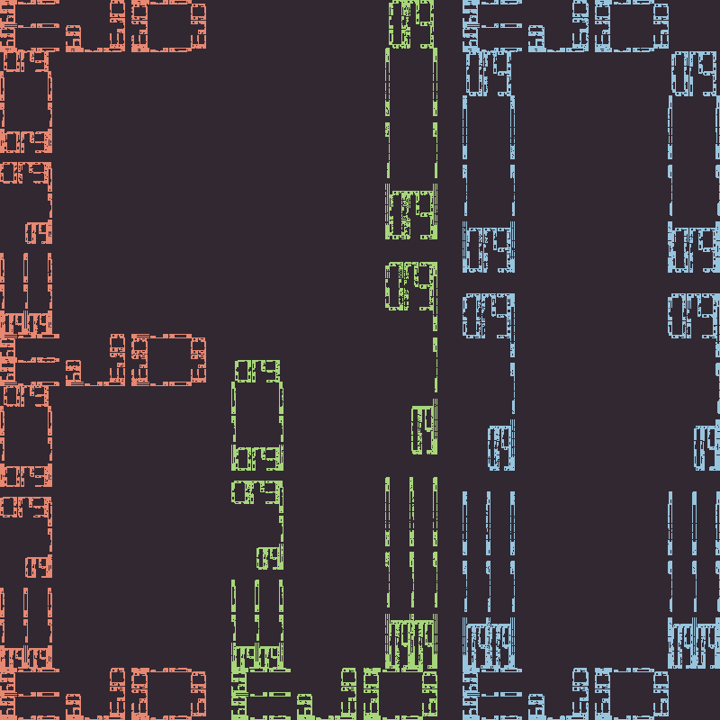

# Final Portfolio Project
**Evan DePosit**  
**CS 410 Exploring Fractals**  

## Compiling

`cc yourProgram.c -lm -lX11`  

## Instalation

To install graphics stuff `sudo apt-get install`:
 g++
 libx11-dev
 libxext-dev
 x11-apps

## Journal Entries

### (1) Initials Block Letters

#### Design Paradigm and Mathematical Description

#### Artistic Description

### (2) Pythagoras tree

#### Design Paradigm and Mathematical Description

#### Artistic Description

### (3) L-system Fern

#### Design Paradigm and Mathematical Description

#### Artistic Description
