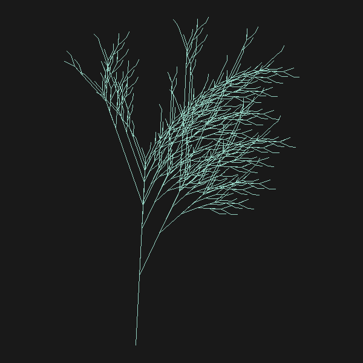

# Final Portfolio Project
**Evan DePosit**  
**CS 410 Exploring Fractals**  

## Compiling

`cc yourProgram.c -lm -lX11`  

## Instalation

To install graphics stuff, `sudo apt-get install`:  
 g++  
 libx11-dev  
 libxext-dev  
 x11-apps  

## Journal Entries

### (1) Iterated Function system: Initials Block Letters


#### Design Paradigm and Mathematical Description


#### Artistic Description

### (2) Recursion: Pythagoras tree


<!--  -->

#### Design Paradigm and Mathematical Description


#### Artistic Description

### (3) L-system: Fern



#### Design Paradigm and Mathematical Description


#### Artistic Description

### (4) Comblex Numbers: Mandelbrot


#### Design Paradigm and Mathematical Description


#### Artistic Description

## Code 

### (1) Iterated Function System: Initials in Block Letters
```
#include "FPToolkit.c"

double x[1] = {0} ;
double y[1] = {0} ;
int n = 1 ;

void translate (double dx, double dy)
{
  int i ;

  i = 0 ;
  while (i < n) {
    x[i] = x[i] + dx ;
    y[i] = y[i] + dy ;
    i = i + 1 ;
  }
}


void scale (double sx, double sy)
{
  int i ;

  i = 0 ;
  while (i < n) {
    x[i] = sx * x[i] ;
    y[i] = sy * y[i] ;
    i = i + 1 ;
  }
}


void rotate (double degrees)
{
  double radians,c,s,t ;
  int i ;

  radians = degrees*M_PI/180.0 ;
  c = cos(radians) ;
  s = sin(radians) ;

  i = 0 ;
  while (i < n) {
     t    = c*x[i] - s*y[i] ;
     y[i] = s*x[i] + c*y[i] ;
     x[i] = t ;
     i = i + 1 ;
  }
}


int main(){
    int j,q ;
    double r ;
    double toRadians = M_PI/180.0;
    double p = 1.0 / 13.0;
    int letter = 0;
    double s = 14.0;
 
    // G_choose_repl_display() ;
    G_init_graphics(800, 800) ;
    G_rgb (50.0/255, 40.0/255, 50.0/255); // dark gray
    G_clear () ;

    srand48(162) ;
 
    j = 0 ;
//j is the number of points
while (j < 1000000) {
    r = drand48() ;  // gives a random double such that 0 <= r < 1
    //E 
    if(r < 1 * p) { //rule 1
        scale(4.0/s, 1.0/s);
        letter = 1;
       
    }
    else if(r < 2 * p) { // rule 2
        scale(4.0/s, 1.0/s);
        translate(0.0, 6.5/s);
        letter = 1;
    }
    else if(r < 3 * p) { //rule 3
        scale(4.0/s, 1.0/s);
        translate(0.0, 13.0/s);
        letter = 1;
    }
    else if(r < 4 * p) { //rule 4
        scale(5.5/s, 1.0/s);
        rotate(90.0);
        //translate(0.0, 1.0/s);
        translate(1.0/s, 1.0/s);
        letter = 1;
    }
    else if(r < 5 * p) { // rule 5
        scale(5.5/s, 1.0/s);
        rotate(90.0);
        //translate(0.0, 8.0/s);
        translate(1.0/s, 7.5/s);
        letter = 1;
    }
    //J
    else if(r < 6 * p) { //rule 6
         scale(4.0/s, 1.0/s);
         translate(4.5/s, 0);
         letter = 2;
    }
    else if(r < 7 * p) { //rule 7
        scale(6.0/s, 1.0/s);
        rotate(90.0);
        translate(5.5/s, 1.0/s);
        letter = 2;
    }
    else if(r < 8 * p) { // rule 8
        scale(13.0/s, 1.0/s);
        rotate(90.0);
        translate(8.5/s, 1.0/s);
        letter = 2;
    }
    //D
    else if(r <  9 * p) { //rule 9
        scale(4.0/s, 1.0/s);
        translate(9.0/s, 0);
        letter = 3;

    }
    else if(r < 10 * p) { //rule 10
        scale(4.0/s, 1.0/s);
        translate(9.0/s, 13.0/s);
        letter = 3;
    }
    else if(r < 11 * p) { //rule 11
        scale(12.0/s, 1.0/s);
        rotate(90.0);
        translate(10.0/s, 1.0/s);
        letter = 3;
    }
    else { //doing rule 12
        scale(12.0/s, 1.0/s);
        rotate(90.0);
        translate(14.0/s, 1.0/s);
        letter = 3;
    }

   //single point in x and y and starts at 0, 0
   if(letter == 1){
        G_rgb (231.0/255, 136.0/255, 114.0/255); // dark gray
   }else if(letter == 2){
        G_rgb (167.0/255, 214.0/255, 122.0/255); // dark gray
   }
   else{
        G_rgb (152.0/255, 197.0/255, 222.0/255); // dark gray
   }
   G_point(800*x[0] , 800*y[0]) ;
   //G_fill_circle(800*x[0] , 800*y[0] , 3) ;
   
   j=j+1 ;
 }

 q = G_wait_key() ;

    G_save_image_to_file("./img/ifc_name.xwd") ;
    G_save_to_bmp_file("./img/ifc_name.bmp") ;
}
```
### (2) Recursive: Pythagoras tree
```
#include  "FPToolkit.c"

double max_dub(double a, double b);
double min_dub(double a, double b);
double distance(double a, double b);
void find_third_point(double*, double*);
void tree(double, double, double, double, int, int, double, double);
void complete_rectangle(double*, double*, double, double, double);
int positive_slope(double x0, double y0, double x1, double y1);
int grows_up(double, double, double, double);
int mid_point(double, double);
double avg_dubs(double*, int);
void make_leaves(double x, double y);

int main()
{
    int    swidth, sheight ;
    double p[2], q[2];
    int maxDepth;

    printf("\nplease depth: ");
    scanf("%d", &maxDepth);

    // must do this before you do 'almost' any other graphical tasks 
    swidth = 600 ;  sheight = 600 ;
    G_init_graphics (swidth,sheight) ;  // interactive graphics
    
    // clear the screen in a given color
    G_rgb (0.3, 0.3, 0.3) ; // dark gray
    G_clear () ;

    G_rgb(1,0,0) ;
    
    // get user input
    G_wait_click(p) ;
    G_fill_circle(p[0],p[1],2) ;

    G_wait_click(q) ;
    G_fill_circle(q[0],q[1],2) ;   

    G_rgb(0,1,0.5) ;
    G_line(p[0],p[1], q[0],q[1]);

    double anchorXs[3];
    double anchorYs[3];
    anchorXs[0]= p[0];
    anchorYs[0]= p[1];
    anchorXs[1]= q[0];
    anchorYs[1]= q[1];
    find_third_point(anchorXs, anchorYs);

    tree(p[0], p[1], q[0], q[1], 0, maxDepth, anchorXs[2], anchorYs[2]);

    int key ;   
    key =  G_wait_key() ; // pause so user can see results

    G_save_image_to_file("./img/pythagorasTreeAutumn.xwd") ;
    G_save_to_bmp_file("./img/pythagorasTreeautumn.bmp") ;
}


double max_dub(double a, double b){
   double c = b - a;
   if(c>0){
       return b;
   }
   return a;
}

double min_dub(double a, double b){
   double c = b - a;
   if(c>0){
       return a;
   }
   return b;

}

double distance(double a, double b){
    return sqrt((a - b) * (a - b));
}

void find_third_point(double * xs, double * ys){
    //case 1 slope is positve
    if((xs[1] - xs[0] > 0 && ys[1] - ys[0] > 0) || (xs[1] - xs[0] < 0 && ys[1] - ys[0] < 0)){
        xs[2] = max_dub(xs[1], xs[0]);
        ys[2] = min_dub(ys[1], ys[0]);
    }
    //case 2 slope is negative
    else{
        xs[2] = min_dub(xs[1], xs[0]);
        ys[2] = min_dub(ys[1], ys[0]);
    }
}


void tree(double x0, double y0, double x1, double y1, int depth, int maxDepth, double anchorX, double anchorY){
    if(depth == maxDepth){
        return;
    }
    double recXs[4];
    double recYs[4];
    double splitTriangleXs[4];
    double splitTriangleYs[4];
    double xAccum = 0;
    double yAccum = 0;

    // make rectangle
    recXs[0] = x0;
    recXs[1] = x1;
    recYs[0] = y0;
    recYs[1] = y1;

    complete_rectangle(recXs, recYs, anchorX, anchorY, 1.5);
    //G_rgb(181/255.0, 96/255.0, 64/255.0); // brown
    G_rgb (0.4, 0.2, 0.1) ; // brown
    G_fill_polygon (recXs, recYs, 4) ;

    // make split tringle
    splitTriangleYs[0] = recYs[2];
    splitTriangleYs[1] = recYs[3];
    splitTriangleXs[0] = recXs[2];
    splitTriangleXs[1] = recXs[3];

    // make square from first to points and average 4 points to find third 
    // on triangle
    //anchor doesn't work, use avg of 4 points from previous square
    complete_rectangle(splitTriangleXs, splitTriangleYs, avg_dubs(recXs, 4), avg_dubs(recYs, 4), 1.0);

    for(int i=0; i<4; i++){
        xAccum =  xAccum + splitTriangleXs[i];
        yAccum =  yAccum + splitTriangleYs[i];
    }
    xAccum =  xAccum/4.0;
    yAccum =  yAccum/4.0;
    splitTriangleXs[2] = xAccum;
    splitTriangleYs[2] = yAccum;

    //G_rgb(181/255.0, 96/255.0, 64/255.0); // brown
    G_rgb (0.4, 0.2, 0.1) ; // brown
    G_fill_triangle(splitTriangleXs[0], splitTriangleYs[0],  splitTriangleXs[1], splitTriangleYs[1], 
               splitTriangleXs[2], splitTriangleYs[2]);

    //make leaves if maxDepth
    if(depth == maxDepth-1){
        make_leaves(xAccum, yAccum);
    }


    //recusrive calls
    tree(splitTriangleXs[2], splitTriangleYs[2], splitTriangleXs[0], splitTriangleYs[0], depth+1, maxDepth, 
    splitTriangleXs[1], splitTriangleYs[1]);
    tree(splitTriangleXs[2], splitTriangleYs[2], splitTriangleXs[1], splitTriangleYs[1], depth+1, maxDepth, 
    splitTriangleXs[0], splitTriangleYs[0]);
    
}

void complete_rectangle(double * xs, double * ys, double anchorX, double anchorY, double scaleFactor){
    double tempX, tempY;
    double a, b;
    //double scaleFactor = 1.0;
    int direction = 1;
    double anchorXDir;
    double anchorYDir;
    double midX;
    double midY;
    double m;
    // y value of line, for same x value as anchor point
    double y2;

    // sort by x coord 
    if(xs[1] < xs[0]){
        tempX = xs[0];
        tempY = ys[0];
        xs[0] = xs[1];
        ys[0] = ys[1];
        xs[1] = tempX;
        ys[1] = tempY;
    }
    if(ys[0] == ys[1]){ //if horizontal line
        a  = distance(xs[0], xs[1]);
        if(anchorY < ys[0]){
            xs[2] = xs[1];
    G_rgb(0,1.0,0.5) ;
            ys[2] = ys[1] + a * scaleFactor;
            xs[3] = xs[0];
            ys[3] = ys[2];
        }
        else{
            xs[2] = xs[1];
            ys[2] = ys[1] - a * scaleFactor;
            xs[3] = xs[0];
            ys[3] = ys[2];
        }
    }
    else if(xs[0] == xs[1]){ // if vertical line
        //sort points so y[0] is lowest
        if(ys[1] < ys[0]){
            tempX = xs[0];
            tempY = ys[0];
            xs[0] = xs[1];
            ys[0] = ys[1];
            xs[1] = tempX;
            ys[1] = tempY;
        }
        a  = distance(ys[0], ys[1]);
        if(anchorX > xs[0]){ // anchor on right
            xs[2] = xs[1] - a * scaleFactor;
            ys[2] = ys[1];
            xs[3] = xs[0] - a * scaleFactor;
            ys[3] = ys[0];
        }
        else{
            xs[2] = xs[1] + a * scaleFactor;
            ys[2] = ys[1];
            xs[3] = xs[0] + a * scaleFactor;
            ys[3] = ys[0];
        }
    }
    else{  //sloped line
        // get third point on trinagle to get x and y offset for legs a and b
        find_third_point(xs, ys);

        // DOES NOT WORK
        anchorXDir = anchorX - mid_point(xs[0], xs[1]);
        anchorYDir = anchorY - mid_point(ys[0], ys[1]);

        // figure out if point is above or below line
        m = (ys[1] - ys[0]) / (xs[1] - xs[0]);
        y2 = m * (anchorX - xs[0]) + ys[0];
        

        if( positive_slope(xs[0], ys[0], xs[1], ys[1])){ //positive sloped line
            b = distance(ys[1], ys[2]);
            a = distance(xs[2], xs[0]);
            
            // if y2 is greater than anchor y, anchor is below line, go up
            if(y2 > anchorY){
                xs[2] = xs[1] - b * scaleFactor; 
                ys[2] = ys[1] + a * scaleFactor;
                xs[3] = xs[0] - b * scaleFactor;
                ys[3] = ys[0] + a * scaleFactor;
            }
            else{
                xs[2] = xs[1] + b * scaleFactor; 
                ys[2] = ys[1] - a * scaleFactor;
                xs[3] = xs[0] + b * scaleFactor;
                ys[3] = ys[0] - a * scaleFactor;
            }
        }
        else{  //negative sloped line
            b = distance(ys[0], ys[2]);
            a = distance(xs[1], xs[2]);

            // if y2 greater than anchor y, anchor is below line, go  up
            if(y2 > anchorY){
                xs[2] = xs[1] + b * scaleFactor;
                ys[2] = ys[1] + a * scaleFactor;
                xs[3] = xs[0] + b * scaleFactor;
                ys[3] = ys[0] + a * scaleFactor;
            }
            else{
                xs[2] = xs[1] - b * scaleFactor;
                ys[2] = ys[1] - a * scaleFactor;
                xs[3] = xs[0] - b * scaleFactor;
                ys[3] = ys[0] - a * scaleFactor;
            }
        }
    }
}

int positive_slope(double x0, double y0, double x1, double y1){
    if((x1 - x0 > 0 && y1 - y0 > 0) ||
        (x1 - x0 < 0 && y1 - y0 < 0)){
        return 1;
    }
    return 0;
}

int grows_up(double y0, double y1, double y2, double y3){
    if(y2 > y0 || y2> y1){
        return 0;
    }
    return 1;
}
int mid_point(double a, double b){
    double offset =  b - a; 
    offset =  offset / 2.0;
    return a + offset;
}

double avg_dubs(double * A, int n){
    double accum = 0.0;
    for(int i=0; i<n; i++){
        accum = accum + A[i];
    }
    return accum / n;
}

//double euclidean_distance(double, double, double, double){}
void make_leaves(double x, double y){
    double r; 
    double p;
    srand48(162) ;
    double delta = 5.0; 
    int red;
    int green;
    int blue;

    //pick random location
    for(int i = 0; i < 8; i++){
        r = drand48() ;  // gives a random double such that 0 <= r < 1
        p = 1.0/9.0;
        if(r < 1 * p) { //rule 1
           x = x;     
           y = y;
        }
        else if(r < 2 * p) { // rule 2
            y =  y + delta;
        }
        else if(r < 3 * p) { // rule 2
            y = y - delta;
        }
        else if(r < 4 * p) { // rule 2
            x = x + delta;
        }
        else if(r < 5 * p) { // rule 2
            x = x + delta;
            y = y + delta;
        }
        else if(r < 6 * p) { // rule 2
            x = x + delta;
            y = y - delta;
        }
        else if(r < 7 * p) { // rule 2
            x = x - delta;
        }
        else if(r < 8 * p) { // rule 2
            x = x - delta;
            y = y - delta;
        }
        else{
            x = x - delta;
            y = y + delta;
        }

        //pick random color
        p = 1.0/8.0;
        if(r < 1 * p) { 
            red = 125;   
            green = 187;
            blue = 110;
            //light green
        }
        else if(r < 2 * p) { 
            red = 75;   
            green = 135;
            blue = 61;
            //darker green
        }
        else if(r < 3 * p) { 
            red = 202;   
            green = 133;
            blue = 72;
            //coral
        }
        else if(r < 4 * p) { 
            red = 250;   
            green = 214;
            blue = 119;
            //mellow yellow

        }
        else if(r < 5 * p) { 
            red = 235;   
            green = 110;
            blue = 78;
            //orange
        }
        else if(r < 6 * p) { 
            red = 253;   
            green = 219;
            blue = 114;
            //gold

        }
        else if(r < 7 * p) { 
            red = 235;   
            green = 97;
            blue = 85;
            //mellow coral
        }
        else{
            red = 221;   
            green = 320;
            blue = 149;
        }
        
        G_rgb(red/255.0, green/255.0, blue/255.0); 
        G_fill_circle (x, y, 3) ;
    }
}
```
### (3) L-system: Fern

### (4) Comblex Numbers: Mandelbrot
```
#include  "FPToolkit.c"
#include <complex.h>

int main()
{
    complex u,v,w,z,c ;
    double  x,y ;
    int sheight=600; 
    int swidth = 600;
    double imagX;
    double imagY;
    int a, b;

   G_init_graphics (swidth,sheight) ;  // interactive graphics
   // clear the screen in a given color
   G_rgb (0.3, 0.3, 0.3) ; // dark gray
   G_clear () ;

    for(int j = 0; j < swidth; j++){
        for(int i = 0; i < sheight; i++){
            //scale to imaginary plane
            imagX = (j - swidth/2.0) * 4.0/swidth;
            imagY = (i - sheight/ 2.0) * 4.0/sheight;
            c = imagX + imagY * I;
            z = 0 + 0 * I;
            //feed into loop
            int k;
            for(k = 0; k < 100; k++){
                z =  z * z + c;

                if(cabs(z) > 100){
                    break;
                }
            }
            //plot
            x = creal(z); 
            y = cimag(z);
            a = (int) x;
            b = (int) y;

            if(cabs(z) > 100){//background
                G_rgb (0.8, 0.0, cabs(z)/255.0); // blue
            }
            else{//fractal part
                //G_rgb (0.0, (y/x), (y/x)) ; // y and y are pretty small
                //G_rgb (0.5, (x/y)*(x/y), (x/y)) ; // pretty good
                //G_rgb (1.0, abs(1.0-(x/y)), abs(1.0-(x/y))) ; 
                G_rgb (k/100.0, (x/y)*(x/y)*.5, .4) ; // blue
            }
            G_point (j, i) ; // hard to see
        }
    }

    int key ;   
    key =  G_wait_key() ; // pause so user can see results

    G_save_image_to_file("./img/tiedyeMandelbrot.xwd") ;
    G_save_to_bmp_file("./img/tiedyeMandelbrot.bmp") ;
}
```
