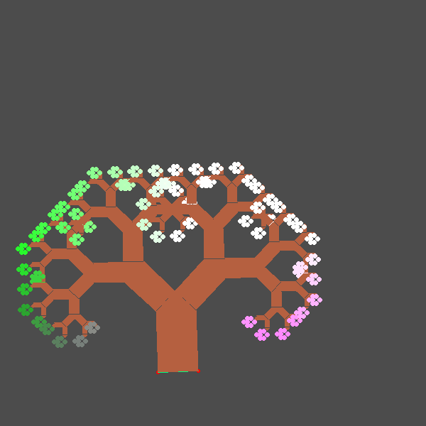

# Final Portfolio Project
**Evan DePosit**  
**CS 410 Exploring Fractals**  

## Instalation

## Compiling

`cc yourProgram.c -lm -lX11`  

## Journal Entries

### Initials Block Letters

#### Design Paradigm and Mathematical Description

#### Artistic Description

### Pythagoras tree

#### Design Paradigm and Mathematical Description

#### Artistic Description

